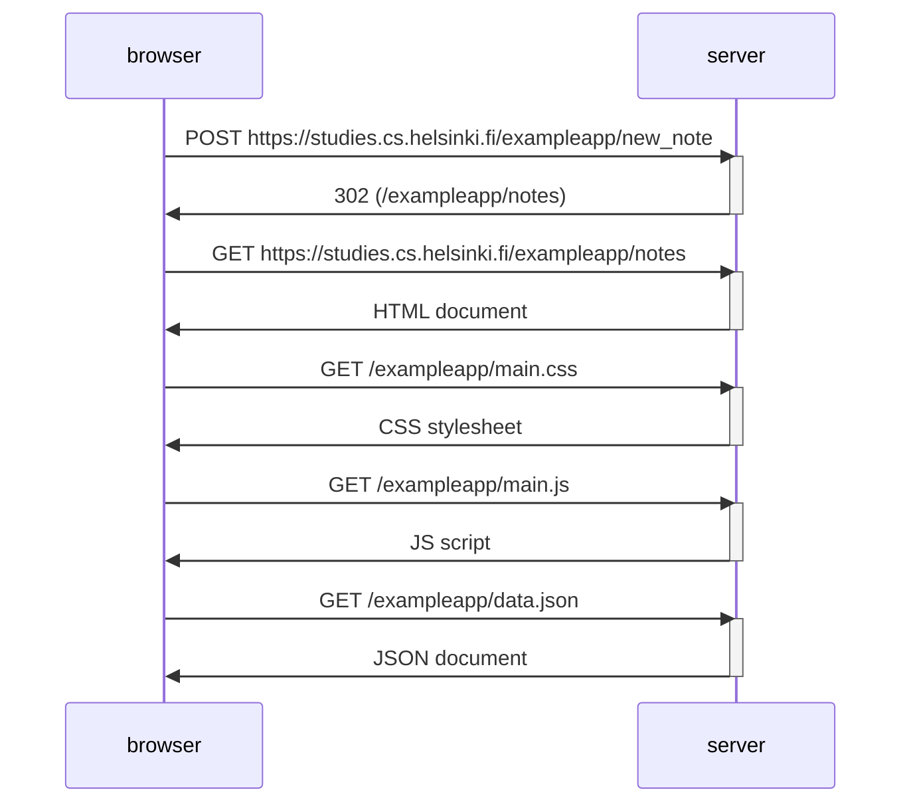

```mermaid
sequenceDiagram
    participant browser
    participant server

    browser->>server: POST https://studies.cs.helsinki.fi/exampleapp/new_note
    activate server
    server->>browser: 302 (/exampleapp/notes)
    deactivate server
    browser->>server: GET https://studies.cs.helsinki.fi/exampleapp/notes
    activate server
    server->>browser: HTML document
    deactivate server

    browser->>server: GET /exampleapp/main.css
    activate server
    server->>browser: CSS stylesheet
    deactivate server

    browser->>server: GET /exampleapp/main.js
    activate server
    server->>browser: JS script
    deactivate server

    browser->>server: GET /exampleapp/data.json
    activate server
    server->>browser: JSON document
    deactivate server
```
