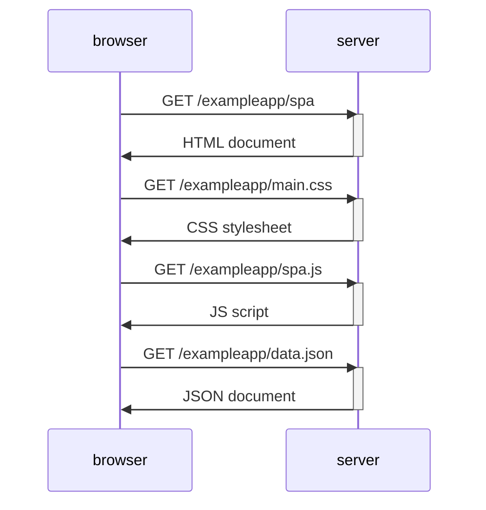

```mermaid
sequenceDiagram
    participant browser
    participant server

    browser->>server: GET /exampleapp/spa
    activate server
    server->>browser: HTML document
    deactivate server

    browser->>server: GET /exampleapp/main.css
    activate server
    server->>browser: CSS stylesheet
    deactivate server

    browser->>server: GET /exampleapp/spa.js
    activate server
    server->>browser: JS script
    deactivate server

    browser->>server: GET /exampleapp/data.json
    activate server
    server->>browser: JSON document
    deactivate server
```